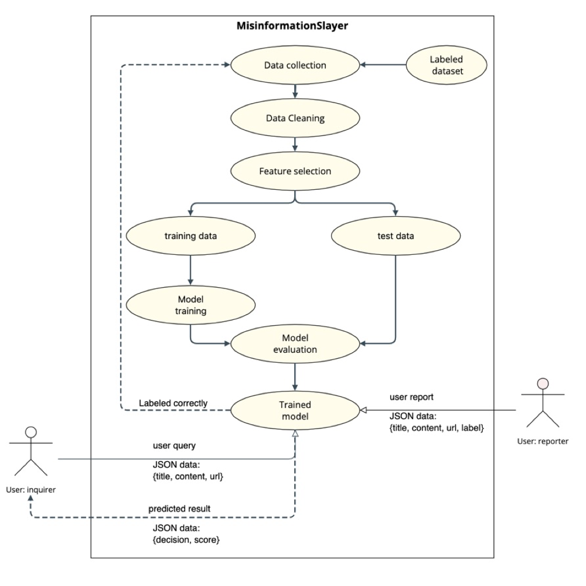
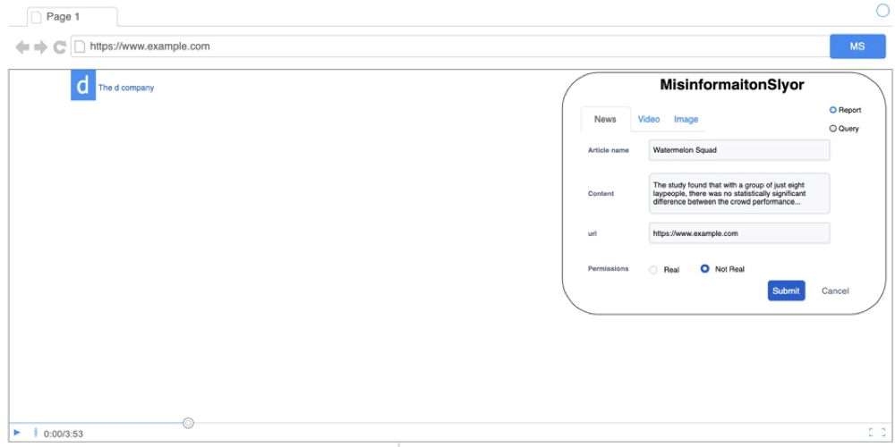
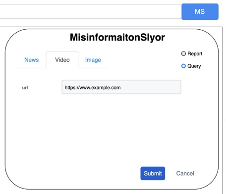

# Misinformation Slayer

## Key words

Misinformation detection, Deep learning, Social network, Web scraping, Browser extension

# **1. Introduction**

# **—**

In this pandemic era, misinformation and fake news can easily mislead people and
generate a serious global risk.

For the people who can tell the misinformation and want to warn others, they do not
have a useful and strong way to express their idea and fight with the misinformation,
as their own social network is quite small and limited. For the people who are not familiar with the fields which are related to misinformation, they tend to believe in the misinformation and even spread it in their own social network.

We want to create a tool to inform and warn people of the misinformation in the webpages and social networks.

MisinformationSlayer is a browser extension aimed to notify people who cannot tell the misinformation spreading on the internet. For the people who can identify the real news, videos and images, they can report the title, content and the url to our system. And for those people who have doubts about the information in the web page, they can query the content and then get the results and scores which are calculated from our system.

# **2. Solution**

# **—**

In order to fight with the misinformation, we cannot avoid the fake articles, manipulated videos, and deep fake images. Our application provides users to report the reality of this information and obtain the calculated results. As the data format of the articles, videos, and images are different, we have to use three different classifiers for them.

For the fake news, we plan to use Fakebox[1] which is a built-in machine learning model for analyzing news articles by looking at different aspects: title, content, and domain name. It provides a nice RESTful API for validating the news and it will be deployed on a Linux server.

For videos, we will focus on detecting manipulated facial videos and plan to utilize the Xception model[2] with fine-tune and suitable hyperparameters to recognize whether the given video is real or fake. In our project, the FaceForensics++[3] will be our pristine data. In this dataset, the fake videos actually derived from 1000 videos containing 509,914 images downloaded from the Internet. We got the dataset after using the three different manipulation methods (Face2Face, DeepFakes, and FaceSwap) on them.

The image detection will also use the Xception model and focus on the detection of manipulated facial images.

*Figure 1: Workflow for reporter and inquirer.*

From Figure 1, for detecting fake news, the reporter can upload the title, content, URL, and label(real or not real) to the model by utilizing RESTful APIs. After classifying the content, if the label is the same as the result, we will store these data to our database. Otherwise, we will drop the data as dirty data. When the number of reported data is big enough, we will union the data with original data and train the model again. For the user who wants to identify the content, he is also required to upload the title, content, and URL of the news. Our server will return the result to the user and the browser extension will display the results.

Reporting videos and images share the similar workflow as reporting news, but the classifier model is different.

# **3. User Interface**

# **—**

*Figure 2: Mockup UI outline*

*Figure 3: Mockup UI: Report news*

Figure 2 is the outline of the browser extension and Figure 3 is the report news page. After the user clicks the browser extension icon, based on Figure 3, the user is able to switch the action between report and query. The user can also pick the content type from news, videos, and images. After filling out the information, the user has to label the information. In the end, he can upload this report to the server.

    *Figure 4: Mockup UI: Query video                                              Figure 5: Mockup UI: Query result*

Figure 4 shows the user choosing to query the video by using the video’s URL. When the server gets this request, it will classify the video and then respond to the browser. When receiving the results from the server, our extension will display the results as Figure 5.

# **4. Milestones and Reporting**

# **—**

[Untitled](report_assets/Untitled%20Database%20509c795d48f04a159226c2090a56dd8c.csv)

# **Reference:**

# **—**

[1]: Veritone, Inc. Fakebox · Docs · Machine Box · Machine Learning in a Box,
machinebox.io/docs/fakebox.

[2] H. Sreter and R. Giryes, ”Learned Convolutional Sparse Coding,” 2018 IEEE
International Conference on Acoustics, Speech and Signal Pro- cessing (ICASSP),
Calgary, AB, Canada, 2018, pp. 2191-2195, doi: 10.1109/ICASSP.2018.8462313.

[3] S. Mohan, Z. Kadkhodaie, E. P. Simoncelli, and C. Fernandez-Granda, “Robust and
interpretable blind image denoising via bias-free convolutional neural networks,” in
International Conference on Learning Representations, 2020